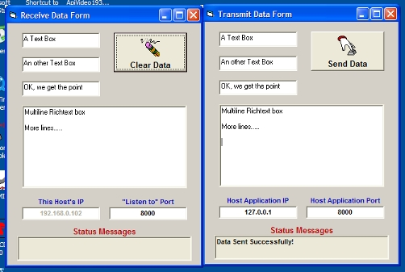



## Winsock based inter\-application communication

### Description

This is an example I did for another PSC member. Others might find it useful.

Simple application to demonstrate a method of inter-application communication with the use of the Winsock control. Project is in two parts.

Part one is the receive or &#8220;Host&#8221; application.

The Host listens in it&#8217;s IP address on a port that is set from the Host Form (default is port 8000).

Part two is the transmit or &#8220;Client&#8221; application.

When the &#8220;send&#8221; button is pressed, the Client connects to the Host, then sends data contained in the text box controls to the Host.

The Host receives data one &#8220;control&#8221; at a time in a Ping-Pong fashion. First the control ID is sent, then acknowledged to the Client (&#8220;ACK&#8221;), then the Client sends the controls data and the Host sends a acknowledgement. This is repeated until all control data is sent to the Host. The Client then disconnects from the host.

The &#8220;Change&#8221; event for the controls on the Host can then be used to process the newly arrived data.

Both applications can be on the same computer (use the loopback address 127.0.0.1),

On different computers on your network, or even used over the public internet (not withstanding router, firewall and NAT translation settings).

No API&#8217;s, no custom controls, just the tools that came with VB6

I hope you fine this useful.

** 21-FEB-2006 Update ** New zip with some error trap fixes
 
### More Info
 

             |
---                |---
**Submitted On**   |2006-02-21 15:21:14
**By**             |[Mark Mokoski](https://github.com/Planet-Source-Code/PSCIndex/blob/master/ByAuthor/mark-mokoski.md)
**Level**          |Beginner
**User Rating**    |5.0 (25 globes from 5 users)
**Compatibility**  |VB 6\.0
**Category**       |[DDE](https://github.com/Planet-Source-Code/PSCIndex/blob/master/ByCategory/dde__1-28.md)
**World**          |[Visual Basic](https://github.com/Planet-Source-Code/PSCIndex/blob/master/ByWorld/visual-basic.md)
**Archive File**   |[Winsock\_ba1975182212006\.zip](https://github.com/Planet-Source-Code/mark-mokoski-winsock-based-inter-application-communication__1-64383/archive/master.zip)

